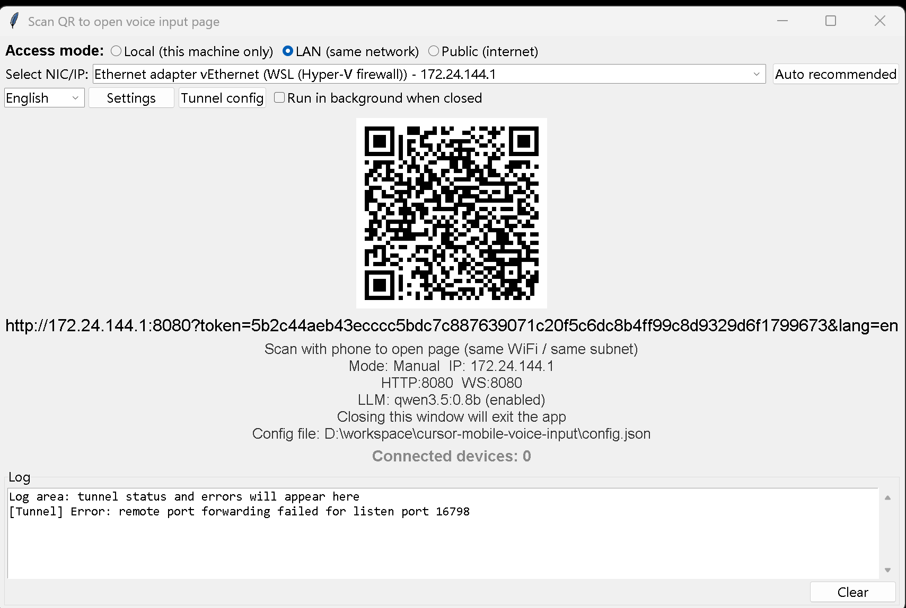
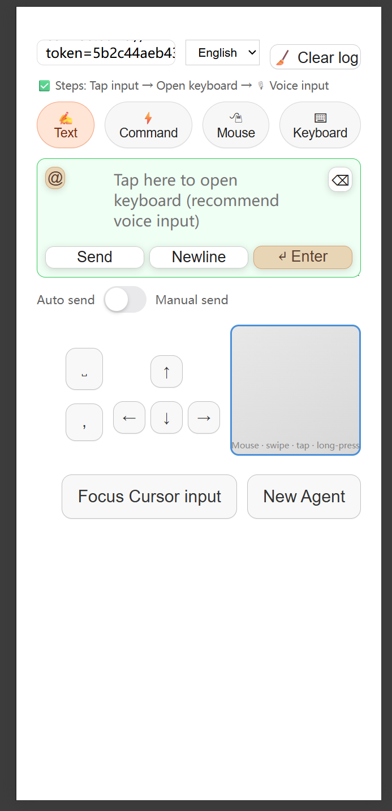

# LAN 语音输入

> **[English Documentation](README.md)**

将手机变成 Windows PC 的语音与远程输入设备。支持 **局域网**（同一 WiFi）和 **公网**（SSH 隧道）两种访问方式。专为 [Cursor IDE](https://cursor.com) 用户设计，同时适用于任何可接收文本输入的应用程序。

---

## 为什么需要这个工具？

如果你使用 **Cursor IDE**（或其他 AI 编程工具），你一定遇到过这些痛点：

- 电脑没有麦克风，或者麦克风质量很差。
- Windows 语音识别反应迟钝，识别准确率远不如手机输入法流畅。
- 你想**解放双手**，通过语音口述提示词、指令或代码注释，不想再去碰键盘。

**这个工具就是为了解决这些问题。** 在电脑上运行服务，用手机扫描二维码，然后开口说话。手机上的语音输入（快速、准确、随手可用）会直接将文字输入到电脑当前聚焦的窗口——包括 Cursor 的 AI 输入框。

> **典型使用场景：** 打开 Cursor → 在手机上点击「Focus Cursor input」→ 说出你的提示词 → 点击发送。完成。全程无需触碰键盘。

---

## 截图

### 服务端（电脑端）



在电脑上运行程序，弹出窗口显示二维码和访问链接。选择网络接口（手机和电脑在同一 WiFi 下选择 LAN 模式），用手机扫码即可立即连接。

### 客户端（手机端）



手机上打开链接后，点击输入框唤起键盘，开启**语音输入**，文字实时发送到电脑。专属快捷按钮可直接跳转到 Cursor 提示词输入框（`Focus Cursor input`）或新建 Agent 会话（`New Agent`）。

---

## 功能特性

- **语音与文本输入** — 使用手机键盘（包括语音输入法）向电脑输入文字。点击输入框，唤起手机键盘，语音或手动输入均可。
- **本地 Ollama 意图分析** — 调用本地 [Ollama](https://ollama.ai) 模型分析用户语音指令并推断意图。当精确字符串匹配失败时，由 LLM 将自然语言短语映射为可执行动作（例如「打开文件传输」→ 启动 LocalSend）。
- **指令模式** — 自然语言语音指令：暂停/继续输入、换行、插入标点（逗号、句号等）、删除 N 个字符、清空输入。通过 Ollama 可选开启 LLM 模糊匹配，在精确匹配失败时自动兜底。
- **鼠标控制** — 滑动移动光标，单击左键，长按右键，双指滚动。
- **虚拟键盘** — 完整的屏幕键盘，支持 Ctrl、Alt、Shift、Win 修饰键及常用快捷键。
- **剪贴板同步** — 服务端自动将电脑剪贴板内容推送到手机，点击即可复制。
- **Cursor 快捷按钮** — 一键「跳转到 Cursor 输入框」（Ctrl+I）和「新建 Agent」（Ctrl+N）。
- **SSH 公网访问** — 当手机与电脑不在同一局域网时，可通过 SSH 隧道在公网访问服务。在二维码窗口的「Tunnel config」中配置；支持本地、局域网、公网三种访问模式。

---

## 工作原理

1. 在 Windows 电脑上运行程序，弹出二维码窗口。
2. 用手机扫描二维码（电脑和手机需在同一 WiFi 下）。
3. 手机上打开网页，开始输入或语音说话。
4. 文字通过 WebSocket 实时发送到电脑当前聚焦的窗口。

服务器仅监听 `127.0.0.1`；手机通过局域网 URL 访问（例如 `http://192.168.1.x:端口`）。HTTP 和 WebSocket 共用同一端口。

---

## 系统要求

- Windows 10/11
- Python 3.8+（开发模式需要）
- 电脑与手机在同一局域网下

---

## 快速开始

### 方式一：源码运行

```bash
# 安装依赖
pip install -r requirements.txt

# 运行服务
python server.py
```

### 方式二：打包为独立可执行文件

1. 在项目根目录创建 `icon.ico`。
2. 运行 `build.cmd`。
3. 运行 `dist\CursorMobileVoiceInput.exe`。

### 开发模式

```bash
dev.cmd
```

开发模式下仅显示二维码窗口（无托盘图标），关闭窗口即退出程序。

---

## 配置说明

配置文件为 `config.json`（与 exe 同目录或项目根目录）。主要配置项：

| 配置项 | 说明 |
|--------|------|
| `user_ip` | 指定二维码使用的局域网 IP（null = 自动检测）|
| `llm_enabled` | 启用 LLM 模糊指令匹配（默认：false）|
| `llm_model` | Ollama 模型名称（例如 `qwen3.5:0.8b`）|
| `llm_base_url` | Ollama API 地址（例如 `http://127.0.0.1:11434`）|
| `commands` | 自定义语音指令（见下方说明）|

### 自定义语音指令

在 `config.json` 的 `commands` 中添加条目：

```json
{
  "name": "打开文件传输",
  "match-string": "打开文件传输",
  "command": "E:\\soft\\LocalSend\\localsend_app.exe",
  "args": []
}
```

- `match-string`：触发指令的精确词语或 LLM 匹配短语。
- `command`：可执行文件路径或命令。
- `args`：可选参数列表。

---

## 项目结构

| 模块 | 功能 |
|------|------|
| `server.py` | 主入口、启动、线程管理 |
| `paths.py` | 可执行文件与资源路径解析 |
| `config_store.py` | 配置文件加载与保存 |
| `settings.py` | 常量与行为标志 |
| `ip_utils.py` | 端口选择、IP 枚举、URL 构建 |
| `notifier.py` | 托盘气泡通知与 Windows Toast |
| `input_control.py` | SendInput 注入、焦点控制、剪贴板 |
| `commands.py` | 语音指令解析与执行 |
| `text_handler.py` | 去重、文本/指令分发 |
| `http_server.py` | Flask + WebSocket 服务器 |
| `qr_window.py` | 二维码窗口与 IP 选择 |
| `tray_app.py` | 系统托盘菜单 |
| `llm_assistant.py` | 可选的 Ollama 指令匹配 |

---

## 致谢

**特别感谢 https://github.com/bfilestor/lan-voice-input 的作者开源了这个项目并给予灵感。正是这份代码让我得以构建并扩展出这款专为 Cursor 定制的远程语音输入工具——工作效率直接翻倍！**

## 许可证

MIT License — 详见 [LICENSE](LICENSE)。
